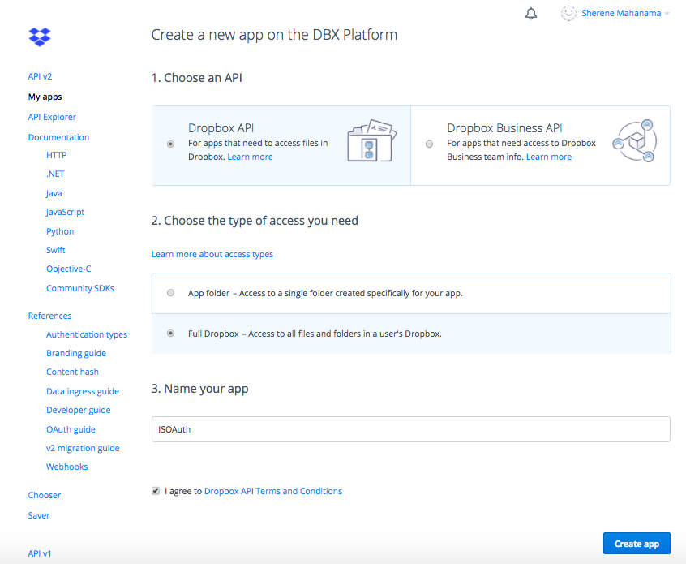
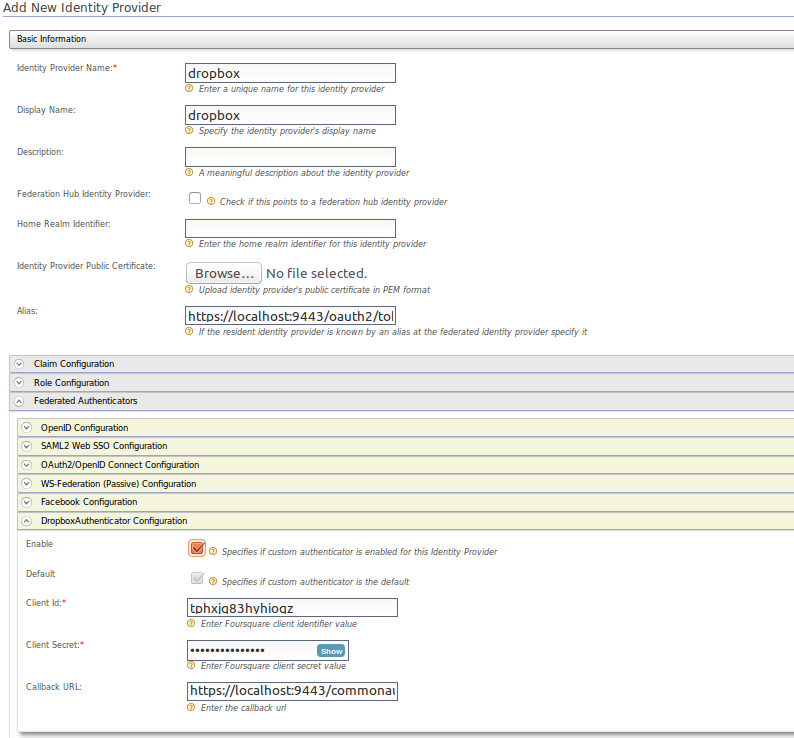
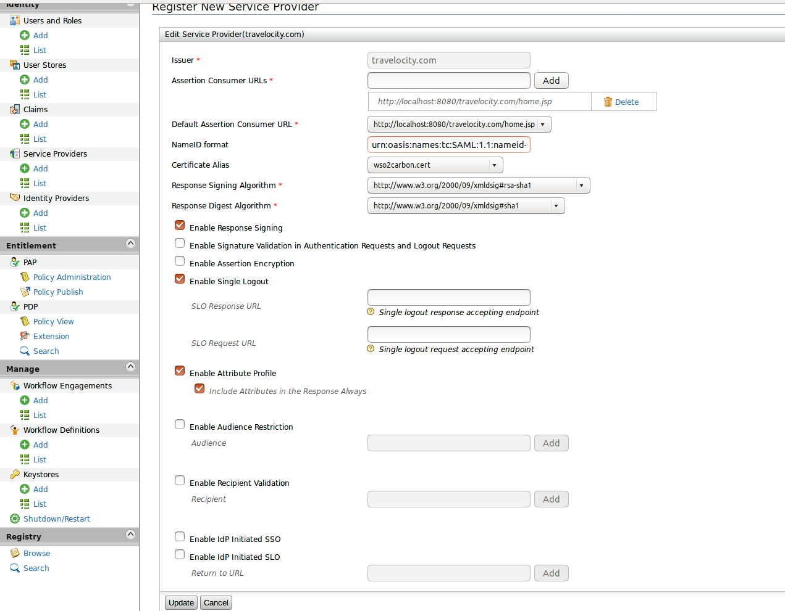
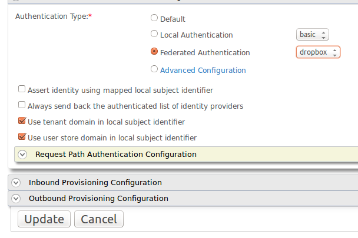
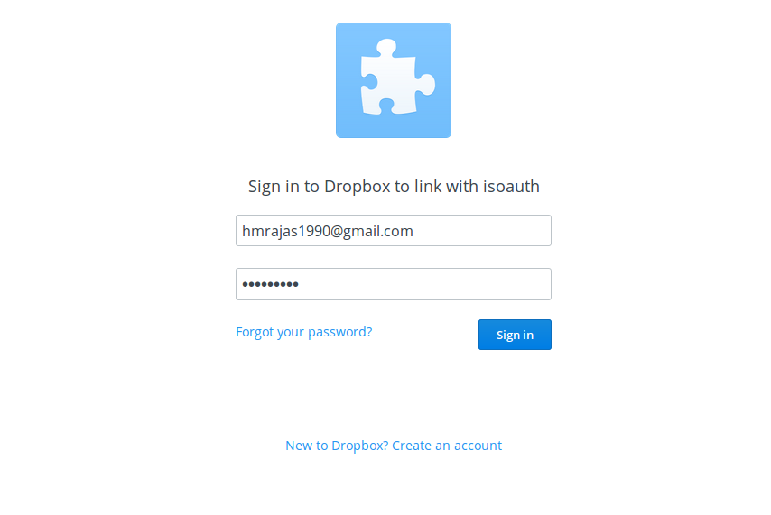
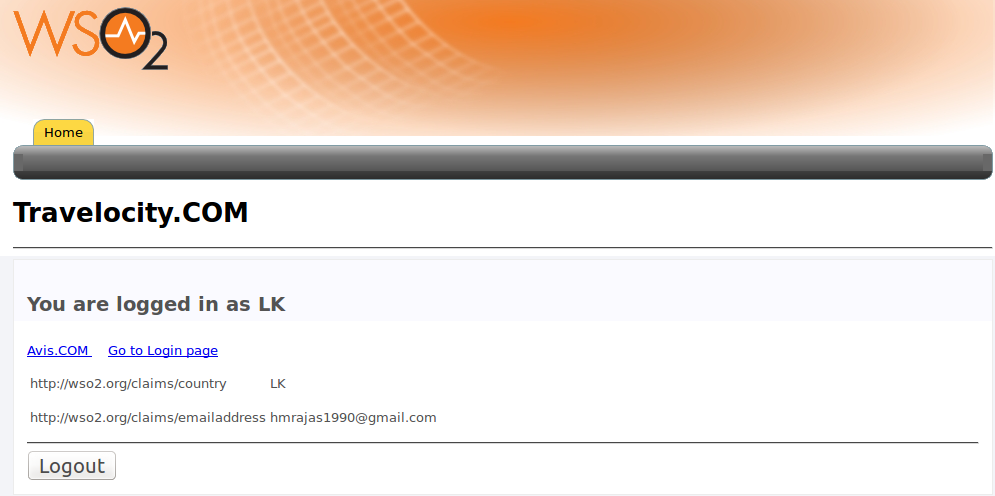

# Configuring Dropbox Authenticator

This page provides instructions on how to configure the Dropbox authenticator and the WSO2 Identity Server to log in to a sample app. You can find more information in the following sections.
 
 ````
 This is tested for the Dropbox API version v2. Dropbox Authenticator is supported by WSO2 Identity Server versions 5.1.0, 5.2.0 ,5.3.0 ,5.4.0  and 5.4.1. 
 ````
 
* [Configuring the Dropbox App](#configuring-the-dropbox-app)
* [Deploying travelocity.com sample app](#deploying-travelocitycom-sample-app)
* [Configuring the identity provider](#configuring-the-identity-provider)
* [Configuring the service provider](#configuring-the-service-provider)
* [Testing the sample](#testing-the-sample)

### Configuring the Dropbox App

1. Place the authenticator .jar file into the <IS_HOME>/repository/components/dropins directory. You can download the.jar(org.wso2.carbon.identity.authenticator.dropbox) file from the [wso2 store](https://store.wso2.com/store/assets/isconnector/details/1a055bda-04d2-467a-972f-31fcdbfd2a49).
 > If you want to upgrade the Dropbox Authenticator (.jar) in your existing IS pack, please refer [upgrade 
 instructions](https://docs.wso2.com/display/ISCONNECTORS/Upgrading+an+Authenticator).
 
2. Navigate to [https://www.dropbox.com/developers/apps](https://www.dropbox.com/developers/apps) and create a new app. You must create or have a Dropbox 
account for this.



3. Enter the name of your new app and click **Create App**.

4. Specify the redirect URI as  [https://localhost:9443/commonauth](https://localhost:9443/commonauth)  in the window that appears.

5. Now you have finished configuring  Dropbox. Copy the **App key** and **App Secret** from the above page.

### Deploying travelocity.com sample app

The next step is to deploy the travelocity.com sample app in order to use it in this scenario.

To configure this, see [deploying travelocity.com sample app](https://docs.wso2.com/display/ISCONNECTORS/Deploying+the+Sample+App).

### Configuring the identity provider

Now you have to configure WSO2 Identity Server by [adding a new identity provider](https://docs.wso2.com/display/IS510/Configuring+an+Identity+Provider).

1. Download the WSO2 Identity Server from [here](https://wso2.com/identity-and-access-management) and [run it](https://docs.wso2.com/display/IS510/Running+the+Product).

2. Log in to the [management console](https://docs.wso2.com/display/IS510/Getting+Started+with+the+Management+Console) as an administrator.

3. In the **Identity Providers** section under the **Main** tab of the management console, click **Add**.

4. Give a suitable name for **Identity Provider Name**.



5. Go to **Dropbox Configuration** under **Federated Authenticators**.

6. Enter the values as given in the above figure.

| Field| Description | Sample Values |
| ------------- |-------------| ---------------|
| Enable    | Selecting this option enables Dropbox to be used as an authenticator for users provisioned to WSO2 Identity Server. | Selected |
| Default    | Selecting the **Default** checkbox specifies **Dropbox** as the main/default form of authentication. If selected, any other authenticators that have been selected as Default will be unselected by WSO2 IS. | Selected |
| Client ID | The app key from the Dropbox application. | owqfgrlhowmgypa |
| Client Secret | The app secret from the Dropbox application. Click the **Show** button to see the value. |lmcbrqwb14algwy|
| Callback URL | The URL to which the browser should be redirected to after the authentication is successful. Follow this format: https://(host-name):(port)/acs . |[https://localhost:9443/commonauth](https://localhost:9443/commonauth) |

7. Click **Register**.

You have now added the identity provider.

### Configuring the service provider

The next step is to configure the service provider.

1. Return to the management console.

2. In the **Service Providers** section under the **Main** tab, click **Add**.

3. Since you are using travelocity as the sample, enter travelocity.com in the **Service Provider Name** text box and 
click **Register**.
 
4. In the **Inbound Authentication Configuration** section, click **Configure** under the **SAML2 Web SSO 
Configuration** 
section.



5. Now set the configuration as follows:
    
    1. Issuer: travelocity.com
    2. Assertion Consumer URL: [http://localhost:8080/travelocity.com/home.jsp](http://localhost:8080/travelocity.com/home.jsp)
6. Select the following check-boxes:
    1. Enable Response Signing.
    2. Enable Single Logout.
    3. Enable Attribute Profile.
    4. Include Attributes in the Response Always.

7. Click **Update** to save the changes. Now you will be sent back to the **Service Providers** page.

8. Go to the **Local and Outbound Authentication Configuration** section.

9. Select the identity provider you created from the dropdown list under **Federated Authentication**.



10. Ensure that the **Federated Authentication** radio button is selected and click **Update** to save the changes.
    
You have now added and configured the service provider.

### Testing the sample

1. To test the sample, navigate to the following URL: http://<TOMCAT_HOST>:<TOMCAT_PORT>/travelocity.com/index.jsp. 
    
    E.g., [http://localhost:8080/travelocity.com](http://localhost:8080/travelocity.com)


2. Click the link to log in with SAML from the WSO2 Identity Server.

3. You are redirected to the Dropbox login page. Enter your Dropbox credentials.



4. You are then taken to the home page of the travelocity.com app.


